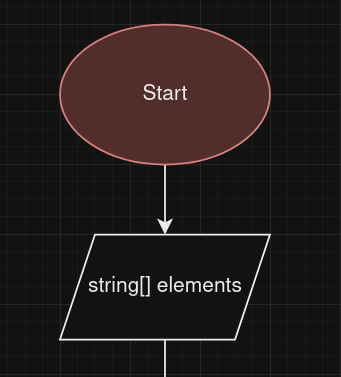
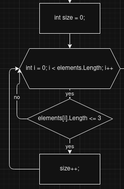
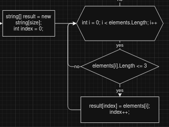
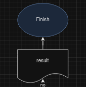
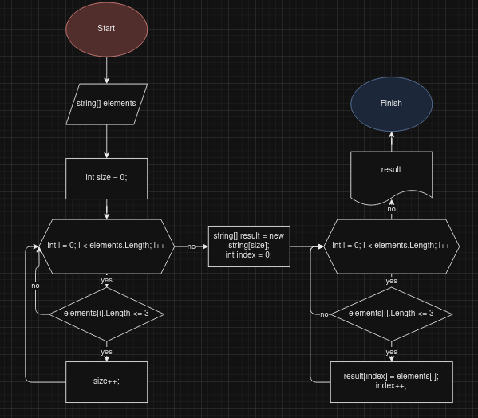
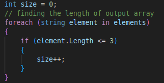
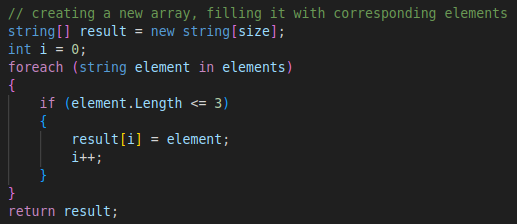
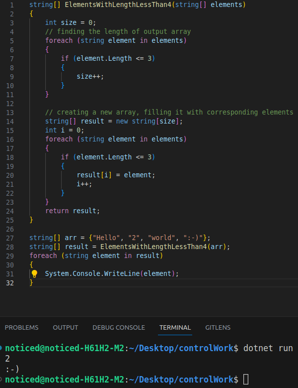

# Control work

## Task

Write a program that filters out all the string values which lengths are equal to or less than 3 and puts them into a new array. It's better not to use collections.

## Things to do

1. Create a Github repository
2. Draw a block-scheme for my algorithm or method
3. Make a README.md file that contains information about how I have accomplished things
4. Write a program that does the required action
5. Use git during the process

## Process

They say it's better not to use collections, which is gonna make the task a little bit more difficult, since I could've just used lists and have no trouble with not knowing the length of the resulting array.

So, the things we'll need in the algorithm are:

- To find out the size of the array we will return
- To create this array
- To fill it with corresponding values
- Return the resulting array

It's said to draw a block-scheme first, so let's get to draw.io and make it.

### Block-scheme creation

'Right, partner, now we need to get our array we're going to get the values from, let's put it into our input field AKA parallelogram.

The next step is to find out the size of the array we're going to return. For that I need to make a new variable **size** = 0 and to go through the entire **elements** array using for loop (from 0 to elements.Length with increment) and increment **size** every time the element length is less than or equal to three.

Next I need to create the resulting array using **size** and I will need a variable **index** which is going to define in which place to put the needed element (it will be incremented every time we find and put the needed element).

The block scheme is almost finished, the only thing left is to return **result** and end the algorithm.

The result block-scheme looks like this:

### Creating README and using git during process

This is what I'm basically doing now and you can see it all. I don't see a point to explain what's happening here.

### Writing a program

Since I already have a block-scheme it will be really easy to write it. All you need to do is simply implement block-scheme into the language you use.

I'm going to create a function called **ElementsWithLengthLessThan4** with a parameter string array **elements**.

Then I find the size of the resulting array. Instead of for loop I'm using foreach, so code looked a bit prettier.

Afterwards, I create the resulting array and basically do the same thing I've done in the loop above, except I don't increment **size** but give a **result[index]** the value of a needed element. And then I return **result**.

## Result

It was an easy task. The only thing that made it more difficult was that I had had to track it all and make a report which took quite some time.

At the end I have this code:

As you can see, below I created an array **arr** and another one, which is simply a filtered **arr**. Then I print out the entire **result** array and it gives me exactly what I need.

The code is in this repository, feel free to look at it and mess with it :^)