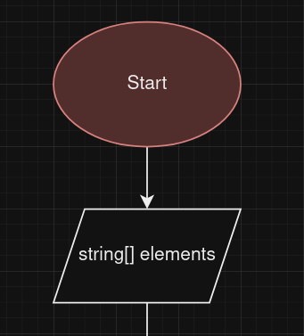
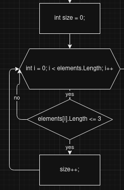
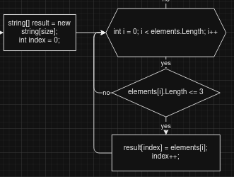
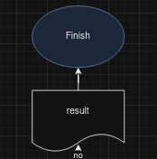
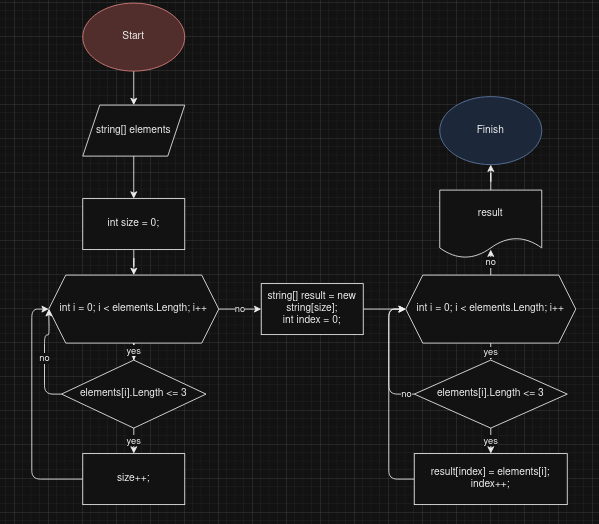
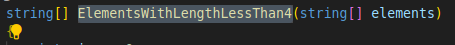
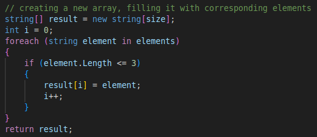
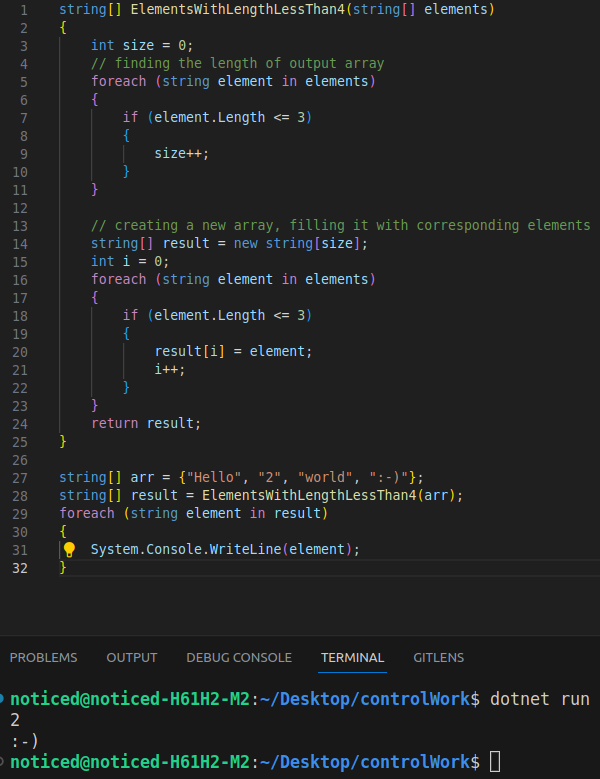

# Итоговая работа

## Задание

Написать программу, которая находит в массиве строк значение, длина которого меньше, либо равна трём, и помещает их в новый массив. Желательно не использовать коллекции.

## Список задач

1. Создать репозиторий на Github
2. Нарисовать блок-схему алгоритма или метода
3. Создать файл README.md, содержащий письменное решение проблемы
4. Написать программу, решающую поставленную задачу
5. Использовать контроль версий по ходу решения

## Процесс

Говорят, коллекции лучше не использовать, что немного усложнит задачу, т.к. я мог бы просто использовать листы и не париться о длине выводимого массива.

Таким образом, нам нужно:

- Найти размер выводимого массива
- Создать этот массив
- Заполнить его нужными элементами
- Вернуть этот массив

Сначала нужно нарисовать блок-схему. Чтоб это сделать, я буду использовать draw.io.

### Создание блок-схемы

Сейчас нам нужно получить массив, из которого мы будем брать данные. Для этого мы в параллелограмме (input field) запрашиваем массив строк **elements**.

Следующий шаг - найти длину возвращаемого массива. Для этого мне нужно создать переменную **size** = 0
и пройти через весь массив **elements**, используя цикл for (от 0, до elements.Length с шагом 1), и инкрементировать **size**
каждый раз, когда встречается элемент с длиной меньше, либо равной 3.

Затем, мне нужно создать конечный массив, используя размер **size**, и мне понадобится переменная **index**,
которая будет определять, куда в новом массиве мне расположить подходящий элемент (с каждым найденным элементом **index** будет
инкрементироваться).

Блок-схема почти закончена. Единственная вещь, которую осталось сделать, - вернуть **result** и закончить алгоритм.

Конечная блок-схема выглядит так:

### Создание README и использование контроля версий

В принципе, это то, чем я сейчас занимаюсь, и вы можете это всё видеть. Я не вижу смысла объяснять, что я здесь делаю.

### Написание программы

Так как у меня уже есть блок-схема, написать программу будет просто. Всё, что нужно сделать, это имплементировать блок-схему
в изучаемый язык. На курсе мы изучали сишарп, поэтому я буду использовать его.

Я создам метод **ElementsWithLengthLessThan4** с параметром массивом строк **elements**.

Затем мне нужно найти размер выводимого массива. Вместо цикла for, я использую foreach, чтобы код выглядел поприятнее.

После, я создаю массив, переменную **i** и, по сути, делаю то же, что и в цикле выше, разве что я инкрементирую не **size**, а **i**,
каждый раз, когда нужный элемент будет помещён в новый массив.  

## Результаты

Задача была достаточно лёгкая. Единственная сложность - отслеживать свой процесс и документировать его. И то скорее не сложность, 
а то, на что я просто потратил достаточно много времени.

В итоге у меня получился такой код:

Как можете видеть, ниже я создал массив **arr** и **result**, который является, по сути, отфильтрованным **arr**.
Затем, я вывожу массив **result**, и в консоль мне выводятся ровно те значения, которые нужны.

Код в этом репозитории. Можете посмотреть на него и поиздеваться :^)